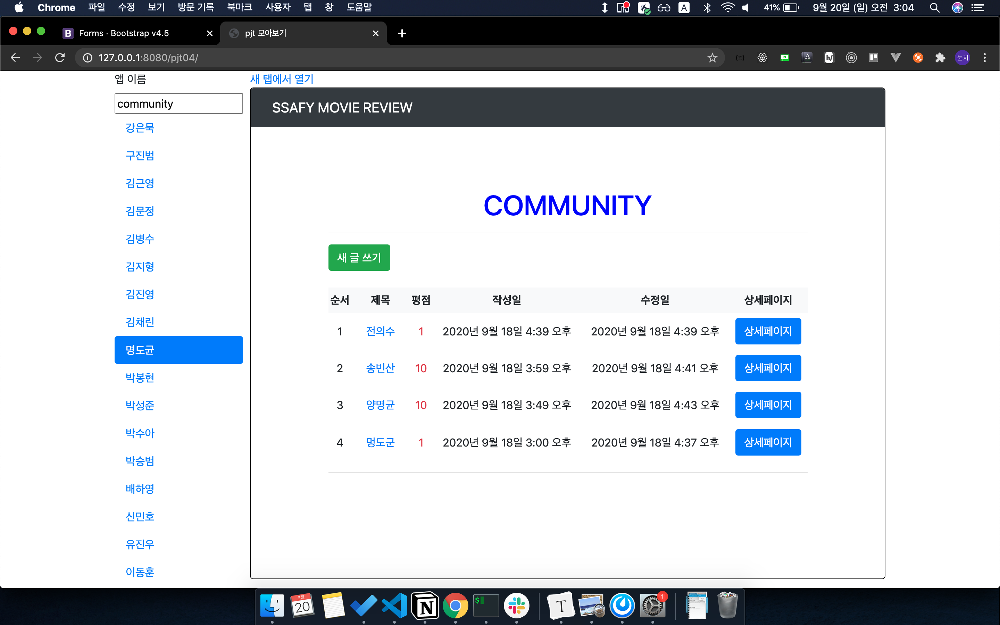
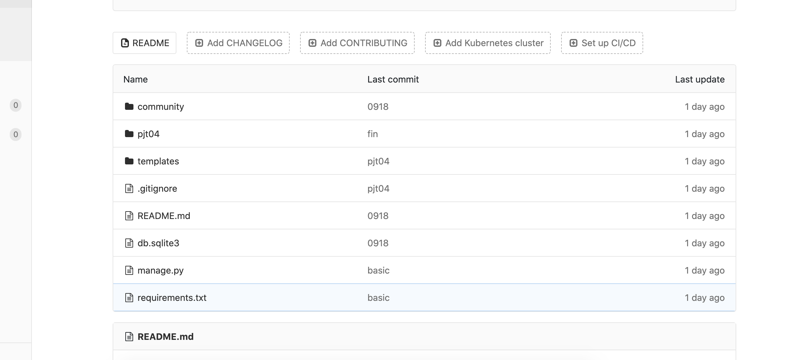
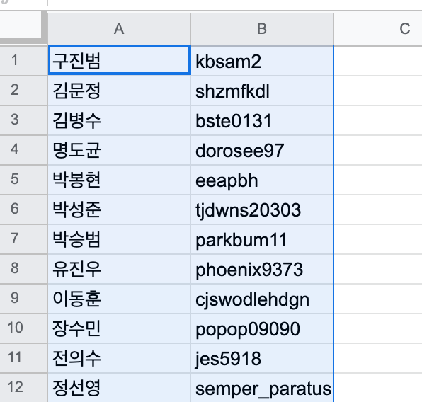
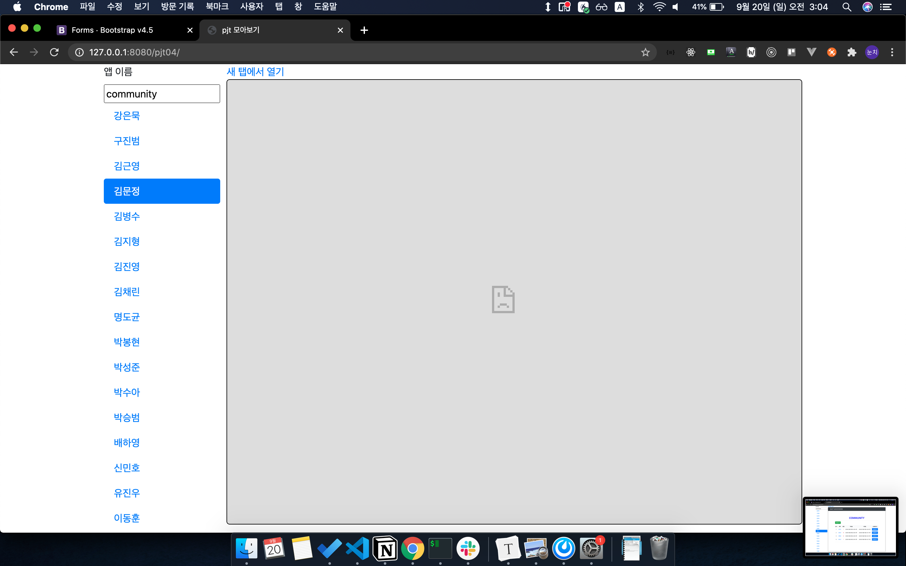

# 관통 PJT 모아 보기

이 django pjt는 학생들의 ssafy 관통 프로젝트를 한 페이지에서 모아 보기 위한 pjt입니다. Shout out to 아이디어 제공자 @tony

## 사용 예시

## 사전 준비 사항

- 학생들의 pjt 이름이 통일 되어야 합니다. ex) pjt04

- pjt의 app 이름 또한 통일되어야 합니다. ex) community

- 학생들의 프로젝트(gitlab)에 마이그레이션이 완료된 `db.sqlite3` 파일이 존재해야 합니다.

- 학생들의 pjt구조는 아래와 같이 통일되어야 합니다.

  - pjt 루트에서 git init을 한 상태여야 합니다.

  - 즉, lab ssafy에서 해당 pjt에 접속하면 바로 아래와 같은 화면이 보여야 합니다.

    

- 이 프로젝트의 `requirements.txt` 외에도 학생들이 3rd party 모듈을 사용했다면 해당 모듈이 설치되어 있어야 올바로 동작 합니다.

- google spread sheet에 아래와 같이 학생들의 이름과 labssafy 유저네임을 준비합니다.

  

## 사용법

1. `students.csv` 에 준비한 google spread sheet의 영역을 복사해 붙여 넣습니다.

2. `python clone.py [pjt 이름]` 로 학생들의 pjt를 clone합니다.

3. `python run_pjt.py [pjt 이름]` 로 학생들 pjt의 모든 서버를 켭니다.

4. 터미널을 하나 더 켜서 `python manage.py runserver 8080` 로 학생들의 pjt를 보여줄 서버를 켭니다. 학생들의 서버가 8000번 포트 부터 시작되기 때문에 8080 포트를 사용합니다.

5. `http://127.0.0.1:8080/[pjt 이름]`으로 접속하면 화면을 확인할 수 있습니다.

6. 기본 앱 이름은 `community`입니다. iframe의 url은 `http://127.0.0.1:포트번호/[앱 이름]`로 설정됩니다. 앱 이름을 바꾸고(ex. admin) `enter`를 치면 바뀐 앱 이름을 통해 iframe이 로딩됩니다. 

7. 학생들의 이름을 클릭하면 해당 url의 iframe이 로딩됩니다.

8. `새 탭에서 열기` 버튼을 통해 현재 iframe에 열린 페이지를 새 탭에서 열 수 있습니다.

   

9. 문제가 있는 pjt는 위 그림과 같이 페이지가 로딩되지 않을 수 있습니다.

