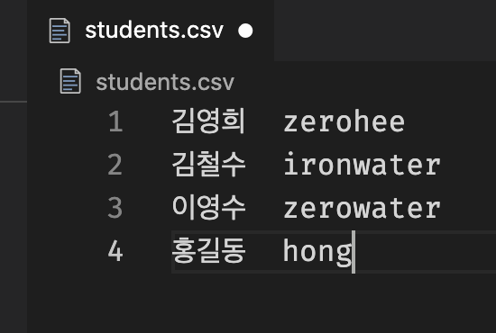

# 관통 PJT 모아 보기

이 django pjt는 학생들의 ssafy 관통 프로젝트를 한 페이지에서 모아 보기 위한 pjt입니다.

[ver1.2가 12월 2일 부로 업데이트 되었습니다!](#업데이트 이력)

문서에서 이번에 변경된 사항에 대한 항목은 :arrow_up: 아이콘을 붙여두었습니다.

## contributors

귀한 주말에 시간을 내어 제 플젝을 열심히 개선해 주신 감사한 분들입니다.

- [tony](https://github.com/autumnsky-tony)
  - `clone.py`에서 학생들의 날뛰는 폴더 구조를 통일시켜 주셨습니다.
  - clone과 함께 마이그레이션 작업도 이루어지도록 개선해 주셨습니다.
- [eric](https://github.com/Machineric) 
  - 원래 두 번이었던 명령어 스텝을 하나로 만들어 주셨습니다.
  - `clone` 과정과 `runproject`과정에서 이쁜 터미널 출력(?)을 만들어 주셨습니다.

## 사용 예시

## 사전 준비 사항

- 학생들의 pjt 이름이 통일 되어야 합니다. ex) pjt04

- pjt의 app 이름 또한 통일되어야 합니다. ex) community

- 이 프로젝트의 `requirements.txt` 외에도 학생들이 3rd party 모듈을 사용했다면 해당 모듈이 설치되어 있어야 올바로 동작 합니다.

- google spread sheet에 아래와 같이 학생들의 이름과 labssafy 유저네임을 준비합니다.

  

## 사용법

1. 루트에 `students.csv`파일을 만들어 준비한 google spread sheet의 영역을 복사해 붙여 넣습니다. 아래의 사진과 같은 형태가 되면 됩니다.

   

2. `$ python clone.py [pjt 이름]` 로 학생들의 pjt를 clone합니다.

   - ~~학생들의 repo를 clone 받는 데 실패하면 아래 사진과 같은 목록이 출력됩니다. 해당 학생의 repo를 확인 후 문제점을 해결했다면 다시 같은 명령어(`python clone.py [pjt 이름]`)를 실행하면 됩니다.~~

   - :arrow_up: clone 실패 학생 목록이 `results.txt`에 따로 저장되게 되었습니다. 터미널에는 몇 명이 실패했는지만 출력됩니다.

   - :arrow_up: clone과 동시에 `username: happy, password: 1234` 인 수퍼유저가 생성됩니다. `clone.py` 의 `SUPER_USERNAME` 과 `SUPER_PASSWORD` 를 수정하면 원하는 유저네임과 비밀번호를 설정하실 수 있습니다.

     

3. `$ python manage.py runproject [pjt 이름] [port]` 을 통해 서버를 켤 수 있습니다. 여기서 `port`는 생략 가능하며, 기본 값으로 8080이 세팅되어 있습니다.

   - :arrow_up: 기존에 터미널에 표시되던 학생들의 서버 로그를 학생 별 프로젝트 폴더의 `server.log`파일에 저장되도록 하였습니다.

   

4. `http://127.0.0.1:8080/[pjt 이름]`으로 접속하면 화면을 확인할 수 있습니다.

5. 기본 앱 이름은 `community`입니다. iframe의 url은 `http://127.0.0.1:포트번호/[앱 이름]`로 설정됩니다. 앱 이름을 바꾸고(ex. admin) `enter`를 치면 바뀐 앱 이름을 통해 iframe이 로딩됩니다. 

6. 학생들의 이름을 클릭하면 해당 url의 iframe이 로딩됩니다.

7. `새 탭에서 열기` 버튼을 통해 현재 iframe에 열린 페이지를 새 탭에서 열 수 있습니다.

8. 문제가 있는 pjt는 아래 그림과 같이 페이지가 로딩되지 않을 수 있습니다.

   

9. 학생의 이름을 클릭하고, README 보기 토글 버튼을 누르면 README를 확인할 수 있습니다.

10. 학생의 폴더에 README.md가 없다면, 아래와 같이 출력됩니다.

    

11. :arrow_up: 학생들의 pjt에 데이터 시딩이 가능합니다.

    - 명령어:  `$ python manage.py runseed [pjt 이름] --number=10 --app=community ` 
      - pjt 이름은 필수 요소이며, 반드시 처음에 위치해야 합니다.
      - `number` 는 몇 개의 데이터를 시딩할지를 결정하며, 생략 가능합니다. default는 10입니다.
      - `app` 은 시딩할 앱이름으로, 생략 가능합니다. default는 community입니다. 
      - 예시: `$ python manage.py runseed pjt05`
    - 학생 별 시드 이력은 각 학생들의 프로젝트 폴더에 `seed.log`로 저장됩니다.

## 업데이트 이력

- 1.2 (20.12.2)
  - clone.py 실행 시 학생들 각 pjt에 superuser 생성 (유저네임:happy, password:1234)
  - 데이터 시딩 기능 추가, 명령어: `$python manage.py runseed [pjt 이름]` 
  - 학생 터미널 출력 로그 파일로 대체
- 1.1 (20.10.9)
  - 학생들의 README를 확인할 수 있는 토글 버튼 추가
  - requirements.txt 수정 (by @tony)
- 1.0 (20.9.21)
  - 학생들 서버 켜는 명령어와 메인 서버 켜는 명령어 통합(by @eric)
  - 학생들 프로젝트 clone과정 추가 (by @eric, @tony)
    - 학생의 중첩된 폴더 구조 수정
    - clone과 동시에 migrate
    - 에러가 발생한 학생 리스트 출력
- 0.1 (20.9.20)
  - 학생들 리스트 클릭하면 해당 앱 index 페이지 뜨는 기능
  - app이름 수정하면 해당 페이지로 이동
  - 새 탭에서 열기 버튼을 통해 지금 iframe에 떠 있는 페이지 새 탭에서 열기 가능

## 참고

- 토글 버튼 https://codepen.io/mallendeo/pen/eLIiG